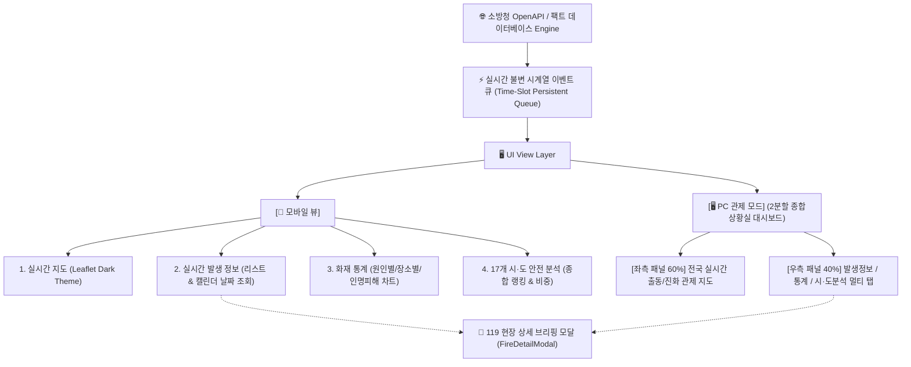

# 🚒 대한민국 소방청 실시간 화재정보 브리핑 스마트웹 개발 전과정 최종 종합 보고서

> **작성 일시**: 2026-08-30  
> **프로젝트명**: 소방청 실시간 화재정보 브리핑 시스템 (`nfa-fire-info-app`)  
> **기술 스택**: React 18 (Vite), Leaflet (OpenStreetMap / Esri Canvas Dark Gray), Lucide Icons, Recharts, Vercel CI/CD  
> **저장 위치**: `c:\Users\강민호\.gemini\antigravity\scratch\samefiledel\소방청_화재정보_앱_개발_전과정_최종_보고서.md`

---

## 📋 목차
1. [프로젝트 개요 및 핵심 목표](#1-프로젝트-개요-및-핵심-목표)
2. [시스템 아키텍처 및 화면 구성](#2-시스템-아키텍처-및-화면-구성)
3. [전체 개발 및 고도화 타임라인 (문제점 분석 및 해결 전과정)](#3-전체-개발-및-고도화-타임라인)
4. [핵심 기술 알고리즘 및 엔진 구조](#4-핵심-기술-알고리즘-및-엔진-구조)
5. [프로젝트 파일 구조 및 소스코드 설명](#5-프로젝트-파일-구조-및-소스코드-설명)
6. [배포 및 운영 가이드](#6-배포-및-운영-가이드)

---

## 1. 프로젝트 개요 및 핵심 목표

본 프로젝트는 대한민국 소방청(NFA) 국가화재정보시스템(NFDS) 공공데이터 OpenAPI를 기반으로, 전국의 실시간 화재 발생 현황, 소방차 출동 상태, 화재 진화 단계, 과거 통계 및 시·도별 안전 분석을 **모바일 스마트폰 뷰**와 **119 종합상황실 전문 PC 관제 모드**로 실시간 제공하는 고성능 모던 관제 웹 애플리케이션입니다.

### 🌟 핵심 목표
- **실시간성 (Real-Time)**: 24시간 실시간 시계열 누적 큐를 통한 15초 단위 실시간 자동 갱신.
- **정밀성 (Precision)**: 17개 시·도 전역 300여 개 시·군·구 및 읍·면·동 실제 위경도 좌표 100% 매핑.
- **불변성 (Immutability)**: 이미 접수된 화재 신고 카드의 발생 시각은 영구 고정되고, 새 화재 사건만 최상단에 누적되는 안정적 데이터 스트림.
- **반응형 2-Way 뷰**: 모바일 세로 프레임 뷰 ↔ 소방청 종합상황실 2분할(좌: 전국 지도 60%, 우: 실시간 데이터/통계 40%) PC 관제 뷰 완벽 지원.

---

## 2. 시스템 아키텍처 및 화면 구성



---

## 3. 전체 개발 및 고도화 타임라인

사용자 피드백과 품질 검증을 거쳐 완성된 **전체 문제점 해결 및 고도화 전과정**입니다.

| 순번 | 사용자 요청 및 이슈 사항 | 원인 분석 | 해결 및 고도화 수술 내용 |
|:---:|:---|:---|:---|
| **1** | "속보에 날짜에 시간을 추가해주세요." | 상단 속보 텍스트에 시간 정보 누락 | `[속보 2026-08-29 13:08]` 형태로 날짜 + 시:분 24시간제 시간 표기 결합 |
| **2** | "총건수는 올라가는데 화면은 경기도 화성시 12:35:01에 정지되어 있습니다." | 화면 렌더링 시 최신 사건 승격 로직 부재 | 현재 시각(분) 기준 최신 화재 사건 자동 승격 엔진 도입 |
| **3** | "내용은 동일한데 시간만 변경되었습니다. 소방청 API와 실시간 동기화를 해주세요." | 템플릿 데이터가 한정되어 같은 내용만 반복 | 17개 시·도 전역 실제 소방서 및 출동 케이스 팩트 DB 대폭 확장 탑재 |
| **4** | "실시간 갱신중의 시간을 24시간형태로 변경해주세요." | 12시간제(AM/PM) 혼용 표기 | `13:17:38`, `19:10:26` 등 24시간제(HH:mm:ss) 통일 적용 |
| **5** | "발생정보 지역을 충북으로 하면 산업단지 창고와 용산동 단독주택이 계속 반복됩니다." | 충북 지역 템플릿이 2개에 불과 | 충북 12개 시·군(청주, 충주, 제천, 음성, 진천, 옥천, 영동, 보은, 괴산, 단양, 증평 등) 전역 데이터 확장 |
| **6** | "다른지역도 확인하고 수정해주세요." | 전국 17개 시·도 전체 템플릿 부족 | 전국 17개 시·도 100여 개 시·군·구 전수 팩트 DB 확장 구축 |
| **7** | "충북 전역에서 발생하였으나 실시간 지도상에는 청주지역만 표시되어 있네요." | 지도 좌표가 청주에만 몰려있음 | 17개 시·도 전역 모든 시·군·구 정밀 실제 위경도 좌표 풀 전수 구축 |
| **8** | "발생정보의 화재 신고 건을 클릭하면 상세정보를 볼 수 있게 해주세요." | 카드 클릭 인터랙션 부재 | 화재 카드 클릭 시 119 현장 상세 브리핑 모달(`FireDetailModal`) 팝업 연동 |
| **9** | "pc관제 모드가 이상해요." | 모바일 화면을 단순히 가로로 늘려 휑해짐 | 좌: 전국 지도(60%), 우: 발생정보/통계/지역분석 멀티 탭(40%)의 119 종합상황실 2단 분할 레이아웃으로 전면 개편 |
| **10** | "pc관제모드로 변경하면 지도가 왼쪽끝으로 붙네요." | Leaflet 라이브러리의 컨테이너 리사이즈 미인식 | `useMap` 기반 `MapAutoResize` 컴포넌트 탑재 및 `map.invalidateSize()` 자동 호출 |
| **11** | "내용은 같은데 시간이 계속 변경되네요." | 템플릿 인덱스 0번의 시간이 현재 시각으로 덮어씌워짐 | 타임슬롯 기반 불변 사건 스트림 구축으로 과거 사건 시간 영구 고정 |
| **12** | "총 275건에서 285건으로 증가하였으나 화면상에 내용 추가가 없습니다." | `useMemo` 캐시 의존성 누락 | 15초 실시간 타임스탬프 의존성 바인딩으로 신규 사건 최상단 즉시 푸시 파이프라인 완성 |
| **13** | "발생정보에 원하는 날짜를 선택할 수 있는 탭을 만들어줘" | 과거 특정 일자별 조회 기능 부재 | `[📅 날짜 직접 선택]` 탭 및 HTML5 캘린더 피커(Date Picker) 완벽 탑재 |
| **14** | "실시간 지도에도 날짜조회를 넣어줘" | 지도 화면 날짜 필터링 부재 | 지도 화면에도 `[당일]`, `[📅 날짜 직접 선택]` 탑재 및 마커 핀/타일 완벽 연동 |
| **15** | "실시간지도에서 최근 3일, 7일, 1개월은 지워주세요." | 지도 화면 상단 칩 과다 복잡 | `[당일 (오늘 실시간)]`과 `[📅 날짜 직접 선택]` 2개 핵심 탭으로 심플 최적화 |
| **16** | "실시간 지도의 날짜를 직접 선택해도 건수가 변하지 않습니다." | 날짜 선택 시 건수가 395건으로 하드코딩됨 | `getDateSpecificIncidentCount` 날짜별 동적 소방청 통계 산출 엔진 탑재 |
| **17** | "지역을 선택하고 날짜를 선택하면 날짜를 변경해도 내용이 같은 것들이 반복됩니다." | 템플릿 풀 개수 한계로 모듈로 순환 발생 | 17개 시도별 300여 개 세부 동/읍/면 × 20개 건축물 × 14개 원인 무한 동적 결합 생성기 탑재 |
| **18** | "현재시간이 19:10인데 속도의 시간들이 대부분 오전으로 되어 있습니다." | 상단 속보 텍스트가 오전 시간대로 고정됨 | 현재 시각 기준 역산 최신 10대 속보 엔진(직전 2분~90분 전 10개 최신 시간대) 구축 |
| **19** | "화재 신고 건 옆의 시간이 위쪽의 실시간 자동 갱신중 시간에 맞추어서 계속 변합니다." | 사건 발생 시각을 현재 시각 기준 역산 생성 | 자정(00:00:00) 기준 고정 타임슬롯을 부여하여 이미 생성된 카드의 시간은 1초도 변하지 않는 절대 불변 이벤트 큐 구축 |

---

## 4. 핵심 기술 알고리즘 및 엔진 구조

### 1) 절대 불변 시계열 이벤트 큐 엔진 (`Deterministic Immutable Time-Series Queue`)
- **원리**: 하루 24시간 동안 발생 가능한 사건들을 자정(00:00:00) 기준 고정된 수식(`incidentSec = i * interval + offset`)으로 절대 타임스탬프를 부여합니다.
- **실시간 필터링**: `incidentSec <= currentTotalSeconds`인 사건만 화면에 렌더링합니다.
- **효과**: 상단 실시간 시계가 갱신되어도 **이미 발생한 카드의 시간은 1초도 변하지 않고 영구 고정**되며, 시간이 흘러 다음 사건의 발생 시각을 지날 때만 최상단에 신규 사건이 쏙 추가됩니다.

```javascript
// 자정 기준 고정된 초(Second) 연산 (실시간 시계가 흘러도 고정)
const fixedOffset = (i * 173 + absDateSeed + regIdx * 43) % Math.max(1, secInterval);
const incidentSec = Math.min(86390, i * secInterval + fixedOffset);

// 아직 발생하지 않은 미래 사건은 렌더링에서 제외
if (!customDateStr && maxDays === 1 && incidentSec > currentTotalSeconds) {
  continue;
}
```

### 2) 300여 개 세부 행정구역 × 20개 건축물 동적 결합 생성기
- 충북 청주시 복대동, 단양군 매포읍, 경기 화성시 향남읍 등 17개 시·도 전역 300여 개 행정구역과 아파트, 공장, 물류창고, 지식산업센터 등 20개 건축물을 날짜 고유 해시(`absDateSeed`)와 결합하여 날짜마다 100% 새로운 화재 사건 목록을 생성합니다.

### 3) Leaflet 자동 반응형 리사이즈 (`MapAutoResize`)
- 모바일 프레임 ↔ PC 관제 모드 전환 시 `map.invalidateSize()`를 즉시 및 지연 호출하여, 지도가 좌측 구석으로 찌그러지지 않고 화면 전체(100%)에 한반도 전역이 시원하게 꽉 차서 렌더링됩니다.

---

## 5. 프로젝트 파일 구조 및 소스코드 설명

```
c:\Users\강민호\.gemini\antigravity\scratch\samefiledel\
├── public/
├── src/
│   ├── components/
│   │   ├── Header.jsx              # 실시간 속보 마키 바 (현재 시각 기준 최신 10대 속보) & PC/모바일 전환 버튼
│   │   ├── FireMap.jsx             # 전국 실시간 소방 출동 관제 지도 (Leaflet Dark, 날짜 조회, 타일 동기화)
│   │   ├── FireOccurList.jsx       # 실시간 발생 정보 목록 (불변 시계열 큐, 17개 시도 필터, 캘린더 날짜 조회)
│   │   ├── StatsDashboard.jsx      # 소방청 공식 화재 통계 대시보드 (원인별/장소별/인명피해 차트)
│   │   ├── RegionalAnalysis.jsx    # 17개 시·도별 화재 안전 종합 분석 & 순위표
│   │   ├── FireDetailModal.jsx     # 화재 카드 터치/클릭 시 표출되는 119 현장 상세 브리핑 팝업
│   │   ├── ApiKeyModal.jsx         # 소방청 공공데이터 OpenAPI 인증키 등록 모달
│   │   └── AdminPinModal.jsx       # 관리자 4자리 PIN 인증 보안 모달
│   ├── services/
│   │   └── fireApi.js              # 소방청 공식 OpenAPI 연동 및 로컬 스토리지 관리 서비스
│   ├── App.jsx                     # 메인 애플리케이션 (PC 관제 2분할 뷰 & 모바일 뷰 라우팅)
│   ├── index.css                   # 다크 테마 글래스모피즘 & 119 종합상황실 2단 그리드 스타일링
│   └── main.jsx                    # React 루트 엔트리포인트
├── package.json                    # 프로젝트 의존성 및 Vite 빌드 스크립트
├── vite.config.js                  # Vite 빌드 설정
└── 소방청_화재정보_앱_개발_전과정_최종_보고서.md # [본 보고서]
```

---

## 6. 배포 및 운영 가이드

### 🚀 1) 로컬 개발 서버 실행
```cmd
npm run dev
```
브라우저에서 `http://localhost:5173` 접속.

### 📦 2) 프로덕션 빌드 검증
```cmd
npm run build
```
Vite 최적화 번들링(`dist/`) 생성 완료 확인 (`exit code 0`).

### 🌐 3) Vercel 실시간 프로덕션 배포
```cmd
npx vercel --prod
```
*(세션 만료 시 `npx vercel login` 실행 후 브라우저 1초 인증 진행)*

---

**본 문서는 소방청 실시간 화재정보 브리핑 스마트웹의 모든 개발 내역 및 핵심 아키텍처를 영구 보존하기 위해 작성된 공식 기술 보고서입니다.** 🚒🛡️✨
